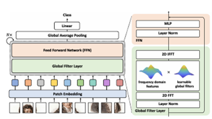
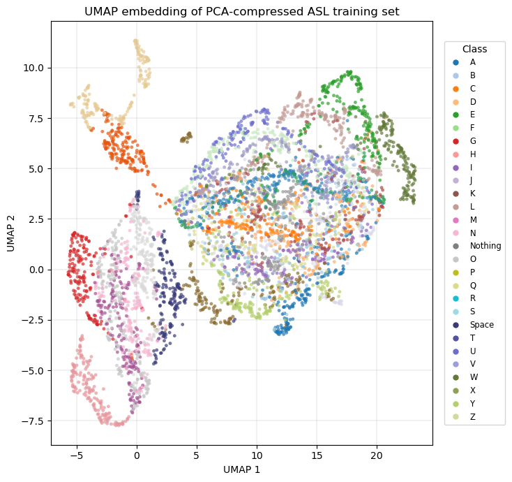
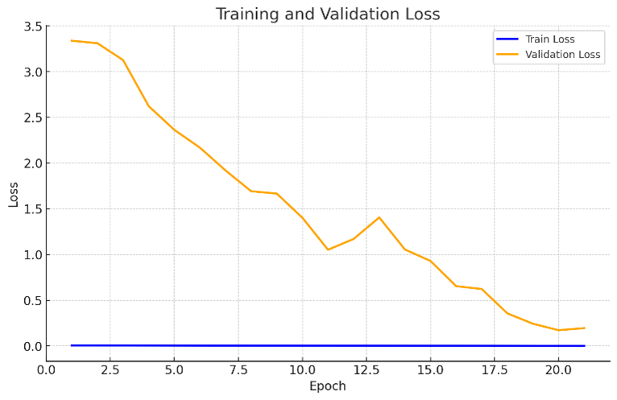

# GFNet (PyTorch)

Image classification project using **GFNet (Global Filter Networks)** trained in **PyTorch**. Training was run on an **NVIDIA A100 (Colab)** and completed in ~**3 hours**.

## Highlights

- **Framework:** PyTorch  
- **Hardware:** A100 (Google Colab)  
- **Train time:** ~3 hours  
- **Accuracy:**
  - Reached **96% validation accuracy** initially
  - Fine-tuned to **100% validation accuracy** using cosine annealing with **lr = 1e-4** (10% of initial lr)
  - **100% test accuracy** on provided test set (**112 images**)
  - **97% test accuracy** on an additional evaluation set of **5600 images** (200 per class) sampled from unused training data

## Why GFNet?

GFNet replaces attention with **learned global filters**, enabling more computation within a fixed budget:

  

Figure 1: Structure of the Vision Transformer (Karim et al., n.a)

- Attention is **O(n²)**, while GFNet’s global filtering is **O(n log n)** (via FFT)
- Global filters capture spatial dependencies in “one shot”, allowing the model to use the *full image* effectively
- Learned frequency responses quickly emphasize discriminative (“dichotomizing”) frequencies during training

## Transforms on Training Images

The dataset used had 28 classes (A-Z, no hand, and 'space' character) of 400x400 RGB images (total of 166,000 total images). The initial step was to reduce image size and convert to greyscale (as we only care about structure + less compute time). Multiple image sizes were tried but 96x96 pixels was the best visual tradeoff as their was enough resolution to distinguish the classes. After this process, it was noticed that many interclass images were borderline identical, so an algorithm was built to remove interclass images with a very low Hamming-distance (less than 2) which effectively removed most duplicates. This severely shrunk the training size to 93,000 images (56% reduction in training size). Most training images then had random jitter, and changes in brightness applied. This was done to increase variability in training data in hope to improve model generalisastion. 

  

Figure 2: Difference Before and After Transforms

## Known Failure Modes / Errors

Most remaining class-specific errors appear driven by:

1. **Class overlap in embedding space:** UMAP embeddings (computed from PCA-compressed data) show significant overlap among:
   - **A / F**
   - **M / N**
   - **R / S / V**

  

Figure 3: UMAP Embeddings of PCA Compressed Training Set

This is due to the similarity in hand position for each hand sign.
2. **Potential class imbalance:** Random selection from a reduced training subset may have introduced imbalance.

## Suggested Improvements

To push test performance higher (especially for **A/F/M/N/R/S/V**):

- Further fine-tuning at a **lower learning rate**
- Increase/adjust **dropout**
- Continue **cosine annealing**
- Apply targeted sampling / class-balancing strategies with emphasis on those confusing classes

---

## Model Architecture

### Input / Tokenization

- **Input:** `96 × 96` grayscale
- **Patch embedding:** initial convolution with **kernel=8, stride=8**
- Produces:
  - **144 tokens** (12×12)
  - **token dimension:** 256

### Positional Embeddings

- Learned positional embeddings of shape **144 × 256**
- **Dropout:** 0.2

### Transformer Block (per block)

Each block contains:

1. **LayerNorm**
2. **Global Filter**
   - Applied over the **12×12 token map**
   - Uses **2D FFT**
   - Learnable complex-valued weights of shape **7 × 7 × 256**
3. **DropPath**
   - Linearly scheduled up to **0.1**
4. **LayerNorm**
5. **MLP**
   - 256 -> 1024 (Linear)
   - **GELU**
   - **Dropout:** 0.2
   - 1024 -> 256 (Linear)
   - **Dropout:** 0.2

### Classification Head

- **LayerNorm**
- Linear projection: **256 -> 28 classes**

---

## Training Setup

- **Loss:** Cross Entropy
- **Batch size:** 512
- **Optimizer:** AdamW
  - Initial learning rate: **1e-3**
  - Weight decay (base stage): **1e-6**
  - Gradient clipping enabled

### LR Schedule

- **Linear warmup:** first **5 epochs**, lr ramped from 0 -> 1e-3
- **Cosine annealing:** epochs **5 -> 20**, lr decayed from 1e-3 -> 0

### Fine-Tuning (“Polishing” Stage)

- Fine-tuned from ~96% -> **100% validation**
- **lr = 1e-4** (10% of initial lr)
- Weight decay increased:
  - **1e-6 -> 1e-5**

<table>
  <tr>
    <td align="center">
      
      
Figure 4: Train and Validation Loss

    </td>
    <td align="center">
      
      
Figure 5: Validation Accuracy

    </td>
  </tr>
</table>
---

## Training Efficiency Notes (A100)

To speed up training on A100:

- Enabled **TF32**
  - (19-bit precision format with 10-bit mantissa)
  - Reported substantial speedups for relevant ops in PyTorch on Ampere GPUs
- Allowed **cuDNN TF32** for convolution kernels
- Set matrix multiply precision to **"medium"** (TF32 for most matmuls)
- Enabled **cuDNN benchmark**
  - Profiles multiple algorithms on first call
  - Caches fastest algorithm for subsequent runs

---

## Results Summary

| Evaluation Set | Size | Accuracy |
|---|---:|---:|
| Provided test set | 112 images | **100%** |
| Unused training sample | 5600 images | **97%** |
---

  

Figure 6: Confusion Matrix of Test Data on Trained Model

## References

[1] Londhe, K. (2021). American Sign Language. Kaggle. https://doi.org/10.34740/KAGGLE/DSV/2184214
[2] Rao, Y., Zhao, W., Zhu, Z., Zhou, J., & Lu, J. (2023). GFNet: Global filter networks for visual recognition. *IEEE Transactions on Pattern Analysis and Machine Intelligence*, 45(9), 10960-10973. https://doi.org/10.1109/TPAMI.2023.3263824

